# sunSale Module Reference

Per-module reference for `custom_components/sun_sale/`. Companion to `ARCHITECTURE.md` (layer-level prose) and `base_load_missing.md` (rationale record). Diagram source mirror: `docs/modules.puml`.

Each module entry has:
- **Description** — ≤3 sentences on what it does.
- **Exposes** — primary type(s) / class(es) it produces.
- **Depends on** — internal `sun_sale` modules it imports (external deps omitted).
- **Tests** — covering test file(s).

Status legend used in the diagram below: 🟩 has dedicated reference doc · 🟨 covered by tests + this entry only · 🟦 external · ⬜ pure-data / no behaviour.

---

## Contents

1. [Status summary](#1-status-summary)
2. [Interaction diagram](#2-interaction-diagram)
3. [contract/](#3-contract)
4. [inbound/](#4-inbound)
5. [pipeline/](#5-pipeline)
6. [outbound/](#6-outbound)
7. [orchestration/](#7-orchestration)
8. [HA root entry points](#8-ha-root-entry-points)
9. [Open follow-ups](#9-open-follow-ups)

---

## 1. Status summary

| Status | Count | Modules |
|---|---|---|
| dedicated reference doc | 6 | `inbound/{pricing,forecast,generation,battery}.py`, `pipeline/{charging_profile,base_load}.py` |
| inline-documented here | 25 | everything else under `custom_components/sun_sale/` |

`pipeline/profitability.py` is **wired** as `ProfitabilityNode` (Tier 2) — the historical "missing" annotation in §9 is resolved. Open items are now smaller in scope (see §9).

---

## 2. Interaction diagram

```mermaid
flowchart TB
    classDef root      fill:#FFF8E1,stroke:#F9A825,color:#5D4037
    classDef orch      fill:#E1BEE7,stroke:#6A1B9A,color:#311B92
    classDef inbound   fill:#C8E6C9,stroke:#2E7D32,color:#1B5E20
    classDef pipe      fill:#BBDEFB,stroke:#1565C0,color:#0D47A1
    classDef out       fill:#FFCCBC,stroke:#D84315,color:#BF360C
    classDef contract  fill:#ECEFF1,stroke:#455A64,color:#263238
    classDef ext       fill:#ffffff,stroke:#9E9E9E,color:#424242,stroke-dasharray:4 3

    HA["Home Assistant<br/>hass.states / services / registry"]:::ext
    SOLIS["solis_modbus<br/>(external integration)"]:::ext

    subgraph ROOT["HA root entry points"]
        R_init["__init__.py<br/>async_setup_entry / service / panel"]:::root
        R_cfg["config_flow.py<br/>SunSaleConfigFlow / OptionsFlow"]:::root
        R_sens["sensor.py<br/>SunSale*Sensor entities"]:::root
        R_sw["switch.py<br/>AutomationSwitch"]:::root
    end

    subgraph ORCH["orchestration/"]
        ORCH_coord["coordinator.py<br/><b>SunSaleCoordinator</b><br/>(DataUpdateCoordinator)"]:::orch
        ORCH_dbg["debug_view.py<br/>SunSaleDebugView"]:::orch
        ORCH_store["persistent_store.py<br/>PersistentStore"]:::orch
    end

    subgraph INBOUND["inbound/  —  HA-state → typed readings"]
        I_price["pricing.py<br/>NordpoolTranslator"]:::inbound
        I_fc["forecast.py<br/>SolarTranslator"]:::inbound
        I_gen["generation.py<br/>GenerationTranslator<br/>PvPowerTranslator"]:::inbound
        I_bat["battery.py<br/>BatteryTranslator"]:::inbound
        I_grid["grid.py<br/>Grid*Translators"]:::inbound
        I_hh["household_load.py<br/>HouseholdLoadTranslator"]:::inbound
        I_hc["household_consumption.py<br/>HouseholdConsumptionTranslator"]:::inbound
        I_mode["inverter_mode.py<br/>InverterModeTranslator"]:::inbound
        I_solis["solis_entity_resolver.py<br/>resolve_solis_entities()"]:::inbound
    end

    subgraph PIPE["pipeline/  —  pure-Python DAG"]
        P_engine["dag_engine.py<br/>DagEngine / DagNode / NodeContext"]:::pipe
        subgraph NODES["nodes/  —  DAG node tiers"]
            P_t1["tier1.py<br/>Pricing / BatteryState /<br/>BatteryStatus / BaseLoadProfile"]:::pipe
            P_t2["tier2.py<br/>Generation / ObservedGeneration /<br/>ObservedGrid / Degradation /<br/>BatteryRuntime / Profitability"]:::pipe
            P_t3["tier3.py<br/>ChargingProfile / Lockout /<br/>ForecastAccuracy / MonthlyBill"]:::pipe
            P_t4["tier4.py<br/>ScheduleNode"]:::pipe
        end
        P_tariff["tariff.py"]:::pipe
        P_bat["battery.py<br/>CapacityEstimator"]:::pipe
        P_calc["calculation.py<br/>(was: calculator.py)"]:::pipe
        P_cp["charging_profile.py"]:::pipe
        P_bl["base_load.py"]:::pipe
        P_sched["schedule.py<br/>(was: optimizer.py)"]:::pipe
        P_acc["forecast_accuracy.py"]:::pipe
        P_prof["profitability.py"]:::pipe
        P_mb["monthly_bill.py"]:::pipe
        P_spec["storage_mode_specs.py<br/>PlannerDecision / select_mode /<br/>build_specs / decode_mode"]:::pipe
    end

    subgraph OUT["outbound/  —  HA-write + actuation"]
        O_inv["inverter.py<br/>InverterController +<br/>SolisV2 / Generic platforms"]:::out
        O_icm["inverter_control_module.py<br/>InverterControlModule"]:::out
    end

    subgraph CONTRACT["contract/  —  pure data, no deps"]
        C_const["const.py — CONF_* / DOMAIN / defaults"]:::contract
        C_models["models.py — every dataclass"]:::contract
        C_events["events.py — ControlEvent / InverterActionEvent"]:::contract
    end

    %% --- HA boundary ---
    HA -->|states| I_price & I_fc & I_gen & I_bat & I_grid & I_hh & I_hc & I_mode
    SOLIS -.->|registry scan| I_solis
    O_inv -->|service calls| HA
    R_init --> HA
    R_cfg --> HA
    R_sens --> HA
    R_sw --> HA

    %% --- HA root → orchestration ---
    R_init --> ORCH_coord
    R_init --> ORCH_dbg
    R_sens --> ORCH_coord
    R_sw --> ORCH_coord
    R_cfg --> O_inv

    %% --- coordinator: the hub ---
    ORCH_coord --> I_price & I_fc & I_gen & I_bat & I_grid & I_hh & I_hc & I_mode & I_solis
    ORCH_coord --> P_engine
    ORCH_coord --> P_t1 & P_t2 & P_t3 & P_t4
    ORCH_coord --> P_bat
    ORCH_coord --> P_acc
    ORCH_coord --> P_prof
    ORCH_coord --> O_inv
    ORCH_coord --> O_icm
    ORCH_coord --> ORCH_store

    %% --- DAG node → helper deps ---
    P_t1 --> P_bl
    P_t1 --> I_bat
    P_t1 --> I_price
    P_t2 --> P_bl & P_bat & P_prof
    P_t2 --> I_fc & I_gen & I_grid
    P_t3 --> P_calc & P_cp & P_acc & P_mb
    P_t4 --> P_sched
    P_t1 & P_t2 & P_t3 & P_t4 --> P_engine

    %% --- intra-pipeline deps ---
    P_sched --> P_bat
    P_sched --> P_spec

    %% --- inbound → outbound/pipeline (deliberate back-edges) ---
    I_bat -->|InverterController| O_inv
    I_grid -->|normalize_power_to_kw| O_inv
    I_mode --> O_inv
    I_mode --> P_spec
    I_price -->|tariff helpers| P_tariff

    %% --- outbound internal ---
    O_icm --> O_inv
    O_icm --> P_spec

    %% --- everyone uses contract ---
    CONTRACT -. types/const/events .-> ORCH_coord
    CONTRACT -. types/const/events .-> INBOUND
    CONTRACT -. types/const/events .-> PIPE
    CONTRACT -. types/const/events .-> OUT
    CONTRACT -. const/types .-> ROOT
```

**Structural facts (read off the diagram):**

- **Coordinator is the only hub.** Every translator, every node tier, both outbound modules, and the persistent store fan out from `SunSaleCoordinator`.
- **Pipeline is layered by tier.** `dag_engine.py` enforces ordering at wire-time; nodes in `nodes/tier{1..4}.py` import only helpers and contract types — never HA, outbound, or orchestration.
- **Inbound-on-outbound back-edges** (deliberate — cross what would otherwise be a clean layer boundary):
  - `inbound/battery.py` and `inbound/inverter_mode.py` import `InverterController` from outbound to read live SoC / register state.
  - `inbound/grid.py` imports `normalize_power_to_kw` from `outbound/inverter.py`.
  - `inbound/pricing.py` calls into `pipeline/tariff.py` to apply buy/sell formulas before data enters the DAG.
- **`storage_mode_specs.py` is a small hub** — `pipeline/schedule.py`, `outbound/inverter_control_module.py`, and `inbound/inverter_mode.py` all import from it.
- **Two outbound modules, distinct roles:**
  - `outbound/inverter.py` — low-level HA service dispatch (platform-specific).
  - `outbound/inverter_control_module.py` — observer + dispatcher that runs after the DAG. Replaces the historical `event_router.py` (gone).
- **`contract/` is a sink** — zero internal imports, depended on by every other layer.

---

## 3. contract/

Pure data types. No imports from any other sun_sale layer. Frozen unless explicitly mutated by the coordinator.

### `contract/const.py`
Configuration key names, storage keys, defaults, retention windows. Pure constants, no logic.
- **Exposes:** `DOMAIN`, `STORAGE_KEY_*`, `CONF_*`, retention constants, Solis defaults.
- **Depends on:** none.
- **Tests:** referenced indirectly through every other test.

### `contract/models.py`
Flat catalogue of every immutable dataclass — configs, primary types, secondary types. New node-level types are added here rather than per-feature submodules.
- **Exposes:** `SunSaleConfig`, `BatteryConfig`, `TariffConfig`, `Action`, `PriceEntry`, `PriceSlot`, `PriceSeries`, `NordpoolData`, `YesterdayPrices`, `SolarData`, `GenerationSlot`, `GenerationSeries`, `ObservedGenerationSeries`, `GenerationReading`, `GenerationHistory`, `PvPowerReading`, `PvPowerHistory`, `BatteryReading`, `BatteryState`, `BatteryStatus`, `EstimatedCapacity`, `CapacityObservation`, `DegradationCost`, `CalculationResult`, `ChargingProfile`, `Schedule`, `ScheduleSlot`, `StorageMode`, `StorageModeSpec`, `InverterModeReading`, `InverterModeChange`, `InverterModeHistory`, `GridPowerReading`, `GridPowerHistory`, `GridImportTodayReading`, `GridExportTodayReading`, `GridImportTodayHistory`, `GridExportTodayHistory`, `ObservedGridSeries`, `MonthlyBillState`, `MonthlyBillResult`, `HouseholdLoadReading`, `HouseholdLoadSample`, `HouseholdLoadHistory`, `HouseholdConsumptionReading`, `BaseLoadProfile`, `BatteryRuntimeEstimate`, `ForecastErrorSeries`, `ForecastAccuracyResult`, `DayClass`, `DailyPeak`, `PriceHistory`, `ProfitabilityScore`, … (single source of truth for typed data — see file).
- **Depends on:** none.
- **Tests:** `tests/test_models.py` (Action enum, frozenness invariants, construction).

### `contract/events.py`
Control-event types emitted by pipeline nodes. Currently the DAG nodes emit empty event lists — dispatch is owned by `outbound/inverter_control_module.py`, which acts on the `Schedule` after the DAG run rather than via events. The types are kept for forward use.
- **Exposes:** `ControlEvent`, `InverterActionEvent`.
- **Depends on:** `contract.models`.

---

## 4. inbound/

Translators read HA state; helpers normalise translator output into pipeline-ready shapes. Translators do not import `homeassistant` — they accept a duck-typed `hass`.

### `inbound/pricing.py` 🟩
`NordpoolTranslator` + 72h `PriceSeries` assembly with tariff applied. → **[inbound_pricing.md](inbound_pricing.md)** for description, exposed types, dependencies, and test coverage.

### `inbound/forecast.py` 🟩
`SolarTranslator` + `GenerationSeries` assembly resampled onto the price grid. → **[inbound_forecast.md](inbound_forecast.md)** for description, exposed types, dependencies, and test coverage.

### `inbound/generation.py` 🟩
`GenerationTranslator` (today-total kWh counter) + `PvPowerTranslator` (instantaneous PV power) + `ObservedGenerationSeries` from differenced samples. → **[inbound_generation.md](inbound_generation.md)** for description, exposed types, dependencies, and test coverage.

### `inbound/battery.py` 🟩
`BatteryTranslator` + `BatteryStatus` snapshot combining configured limits with observed SoC. → **[inbound_battery.md](inbound_battery.md)** for description, exposed types, dependencies, and test coverage.

### `inbound/grid.py`
Three translators feed grid telemetry:
- `GridObserver` snapshots the inverter's signed net AC grid power each cycle (positive = import, negative = export); samples persist into `GridPowerHistory`.
- `GridImportTotalTranslator` / `GridExportTotalTranslator` snapshot the daily-resetting cumulative import/export kWh counters. They anchor the end-of-day correction in `ObservedGridSeries`.

`build_observed_grid_series()` averages signed grid-power samples within each price-grid slot but **splits gross flows per sample** (`max(0, kw)` for import, `max(0, -kw)` for export) — preserves gross import/export even when a slot's net averages to zero.
- **Exposes:** `GridObserver`, `GridImportTotalTranslator`, `GridExportTotalTranslator`, `build_observed_grid_series()`.
- **Depends on:** `contract.models`, `outbound.inverter` (`normalize_power_to_kw`).
- **Tests:** `tests/test_grid_inbound.py` — `test_empty_history_yields_empty_series`, `test_empty_price_grid_yields_empty_series`, `test_pure_import_slot_averages_to_imported_kwh`, `test_pure_export_slot_averages_to_exported_kwh`, `test_mixed_sign_slot_preserves_gross_flows`, `test_partial_slot_is_clamped_at_now`, `test_end_of_day_correction_scales_today_import_to_counter`, `test_end_of_day_correction_independent_per_side`, `test_correction_skipped_when_factor_out_of_bounds`, `test_correction_skipped_for_yesterday_slots`, `test_series_totals_match_per_slot_sums`.

### `inbound/inverter_mode.py`
`InverterModeTranslator` reads the inverter's current `StorageMode` per cycle. Pulls register 43110 readback + battery currents + RC active-power setpoint from `InverterController` and decodes via `pipeline.storage_mode_specs.decode_mode`. Resilient to missing entities — any unreadable field becomes `None` and the decoded mode collapses to `StorageMode.UNKNOWN`.
- **Exposes:** `InverterModeTranslator` → `InverterModeReading`.
- **Depends on:** `contract.models`, `outbound.inverter`, `pipeline.storage_mode_specs`.
- **Tests:** `tests/test_inverter_mode_translator.py` — decodes GULP/DUMP/SELL/STBY from register state, returns UNKNOWN on missing register, preserves timestamp.

### `inbound/household_load.py`
`HouseholdLoadTranslator` reads the instantaneous household-load sensor; returns `None` when unavailable (deliberately distinct from `BatteryTranslator`'s 0.2 kW stub — see `base_load_missing.md`).
- **Exposes:** `HouseholdLoadTranslator` → `HouseholdLoadReading`.
- **Depends on:** `contract.models`.
- **Tests:** covered indirectly via `tests/test_base_load.py` (sample ingestion) and `tests/test_coordinator.py` (persistence).

### `inbound/household_consumption.py`
`HouseholdConsumptionTranslator` snapshots the today-total household-load kWh counter (e.g. `sensor.namai_inv_household_load_today_energy_2`). Cumulative counter that resets at local midnight — used downstream to display "consumption so far today" without re-deriving it from instantaneous samples.
- **Exposes:** `HouseholdConsumptionTranslator` → `HouseholdConsumptionReading`.
- **Depends on:** `contract.models`.
- **Tests:** covered indirectly via `tests/test_coordinator.py`.

### `inbound/solis_entity_resolver.py`
`resolve_solis_entities(hass, solis_config_entry_id)` scans the HA entity registry for entities belonging to a given solis_modbus config entry. Matches by `unique_id` suffix (register-based for the 43110 readback and bit-switches; named suffix for sensors/numbers). Drives the auto-detection path documented in `CLAUDE.md`.
- **Exposes:** `resolve_solis_entities()`.
- **Depends on:** none from sun_sale; uses HA entity registry directly.
- **Tests:** covered indirectly via `tests/test_config_flow.py` and end-to-end coordinator integration.

---

## 5. pipeline/

Pure-Python DAG engine + node logic + helpers. All testable without an HA harness.

### `pipeline/dag_engine.py`
`DagNode`, `DagEngine`, `NodeContext`, `run_translators`. Tier check enforced at wire-time via `TierViolationError`; all ready nodes within a tier run concurrently with `asyncio.gather`.
- **Exposes:** `DagEngine`, `DagNode`, `NodeContext`, `MissingDependencyError`, `TierViolationError`, `run_translators`.
- **Depends on:** `contract.events`, `contract.models`.
- **Tests:** covered indirectly via `tests/test_coordinator.py` (full DAG run).

### `pipeline/nodes/` (tier1.py, tier2.py, tier3.py, tier4.py)
The 15 registered `DagNode` subclasses, split by execution tier. Each declares `tier`, `output_type`, `consumes`; `DagEngine._wire()` builds the observer graph from those declarations.

| Tier | Node | `output_type` | `consumes` |
|---|---|---|---|
| 1 | `PricingNode` | `PriceSeries` | `NordpoolData`, `YesterdayPrices` |
| 1 | `BatteryStateNode` | `BatteryState` | `BatteryReading`, `EstimatedCapacity` |
| 1 | `BatteryStatusNode` | `BatteryStatus` | `BatteryReading` |
| 1 | `BaseLoadProfileNode` | `BaseLoadProfile` | `HouseholdLoadHistory` |
| 2 | `GenerationNode` | `GenerationSeries` | `SolarData`, `PriceSeries` |
| 2 | `ObservedGenerationNode` | `ObservedGenerationSeries` | `PvPowerHistory`, `GenerationHistory`, `PriceSeries` |
| 2 | `DegradationNode` | `DegradationCost` | `BatteryState` |
| 2 | `BatteryRuntimeNode` | `BatteryRuntimeEstimate` | `BatteryStatus`, `BaseLoadProfile` |
| 2 | `ObservedGridNode` | `ObservedGridSeries` | `GridPowerHistory`, `GridImportTodayHistory`, `GridExportTodayHistory`, `PriceSeries` |
| 2 | `ProfitabilityNode` | `ProfitabilityScore` | `PriceSeries`, `PriceHistory` |
| 3 | `ChargingProfileNode` | `ChargingProfile` | `BatteryStatus`, `GenerationSeries`, `PriceSeries` |
| 3 | `ForecastAccuracyNode` | `ForecastAccuracyResult` | `GenerationSeries`, `ObservedGenerationSeries` |
| 3 | `MonthlyBillNode` | `MonthlyBillResult` | `PriceSeries`, `ObservedGridSeries` |
| 3 | `LockoutNode` | `CalculationResult` | `PriceSeries`, `GenerationSeries`, `BatteryState` |
| 4 | `ScheduleNode` | `Schedule` | `PriceSeries`, `CalculationResult`, `GenerationSeries`, `BatteryState`, `DegradationCost`, `ChargingProfile` |

All nodes currently return an empty event list — dispatch happens post-DAG via `InverterControlModule.tick()`, not via `ControlEvent` flow.

- **Depends on:** `pipeline.{base_load, battery, calculation, charging_profile, forecast_accuracy, monthly_bill, profitability, schedule}`, `inbound.{battery, forecast, generation, grid, pricing}`, `contract.{models, events}`.
- **Tests:** each node's logic is tested in its helper module's test file (see per-helper sections below).

### `pipeline/tariff.py`
Pure formula module: `buy_price` / `sell_price` from Nordpool spot given a `TariffConfig`; `compute_tariffs(entries, config)` applies them to a list of `PriceEntry`.
- **Exposes:** `buy_price`, `sell_price`, `compute_tariffs`.
- **Depends on:** `contract.models`.
- **Tests:** `tests/test_tariff.py` — buy/sell formulas, zero/negative spot handling, `buy > sell` invariant, length preservation.

### `pipeline/battery.py`
`CapacityEstimator` (EWMA over `CapacityObservation`s, serialisable through coordinator persistence) plus `degradation_cost_per_kwh` and `trade_profit_per_kwh` helpers.
- **Exposes:** `CapacityEstimator`, `degradation_cost_per_kwh`, `trade_profit_per_kwh`.
- **Depends on:** `contract.const`, `contract.models`.
- **Tests:** `tests/test_battery.py` — degradation formula, trade-profit thresholds, estimator convergence, serialise/deserialise round-trip.

### `pipeline/calculation.py`
(Renamed from `calculator.py`.) Computes feed-in lockout windows from negative-sell slots and per-slot decisions; emits user-facing notes (battery-full-during-lockout, paid-to-charge).
- **Exposes:** `compute_calculation(...) → CalculationResult`.
- **Depends on:** `contract.models`.
- **Tests:** `tests/test_calculation.py` — positive/negative prices, lockout coalescing, battery-full and paid-to-charge notes.

### `pipeline/schedule.py`
(Renamed from `optimizer.py`.) Greedy pair-match scheduler — pairs cheap charge slots with profitable discharge slots respecting SoC, power, lockout, and degradation constraints. Translates each internal `PlannerDecision` to a `StorageMode` via `storage_mode_specs.select_mode`.
- **Exposes:** `optimize_schedule(...) → Schedule`.
- **Depends on:** `contract.models`, `pipeline.battery`, `pipeline.storage_mode_specs`.
- **Tests:** `tests/test_schedule.py` — empty/flat tariffs, buy-low-sell-high, degradation cutoff, SoC/power bounds, solar-slot mapping to STORE/HOARD, idle→AUTO/STBY based on sell sign, lockout windows.

### `pipeline/storage_mode_specs.py`
Owns the planner ↔ inverter mapping for the Solis StorageMode state machine (see `docs/solis_control.md`):
- `PlannerDecision` — internal planner-side per-slot decision enum (pipeline-only; not in `contract/`).
- `build_specs(...)` — concrete `StorageModeSpec` for each mode given battery + inverter limits.
- `decode_mode(...)` — best-effort decode of observed register state → `StorageMode` (used by `inbound/inverter_mode.py`).
- `select_mode(...)` — map a `(PlannerDecision, ChargingProfileSlot, PriceSlot)` triple to the concrete `StorageMode`.
- **Exposes:** `PlannerDecision`, `build_specs`, `decode_mode`, `select_mode`.
- **Depends on:** `contract.models`.
- **Tests:** `tests/test_storage_mode_specs.py` (28 tests) — covers `build_specs` register bitmasks, `decode_mode` round-trip vs `build_specs`, `select_mode` mapping for every `(PlannerDecision, profile, sell-sign)` combination.

### `pipeline/charging_profile.py` 🟩
Per-slot disposition of today's remaining solar (`solar_charge` / `sell` / `no_export` / `idle`). → **[pipeline_charging_profile.md](pipeline_charging_profile.md)**.

### `pipeline/base_load.py` 🟩
24h baseload profile (P10 per local-hour bucket) + battery-runtime estimate. → **[pipeline_base_load.md](pipeline_base_load.md)**.

### `pipeline/forecast_accuracy.py`
Two pieces:
- Per-slot delta between `GenerationSeries` (forecast) and `ObservedGenerationSeries` (measured) → `ForecastErrorSeries`. Sign convention `error_kwh = observed − forecast`.
- EMA-based quality buckets in three groups (intensity bins, dawn/dusk position, time-of-day) updated each DAG cycle to track forecast skill over time.
- **Exposes:** `compute_forecast_errors`, `ForecastAccuracyResult`, EMA helpers.
- **Depends on:** `contract.models`.
- **Tests:** `tests/test_forecast_accuracy.py` — empty inputs, perfect / under / over forecast, MAE/bias/MAPE aggregates, partial overlap, divide-by-zero on zero forecast.

### `pipeline/profitability.py`
Day-class-normalised rolling 30d percentile of daily peaks (weekday / weekend / holiday buckets) to drive sell-now vs hold. Now wired as `ProfitabilityNode` (Tier 2); `PriceHistory` is supplied by the coordinator from a persistent store of `DailyPeak`s.
- **Exposes:** `compute_profitability_score`, `daily_peak_from_entries`, `classify_day`, helpers.
- **Depends on:** `contract.models`.
- **Tests:** `tests/test_profitability.py` — day classification (incl. holiday-on-weekend), percentile rank, day-class median bucketing, sparse-history fallback, score normalisation by class.

### `pipeline/monthly_bill.py`
Pure Python — builds a per-price-slot cost series for the live window `[yday_start, now)` and adds a persisted `carry_eur` covering the bill from month-start up to start of yesterday. Per-slot `import / export kWh` comes from `ObservedGridSeries`; priced through `PriceSeries` as `import_kwh * buy − export_kwh * sell`. No floor on `sell` — negative sell prices charge the exporter.
- **Exposes:** `compute_bill_slots`, `apply_state_transitions`, `MonthlyBillResult`, `MonthlyBillState`.
- **Depends on:** `contract.models`.
- **Tests:** `tests/test_monthly_bill.py` — dense zero slots, import × buy / export × sell pricing (incl. negative sell), first-run carry init, day rollover folds yesterday into carry, month rollover finalises previous-month total.

---

## 6. outbound/

Only `inverter.py` calls HA services. `inverter_control_module.py` is the post-DAG observer/dispatcher.

### `outbound/inverter.py`
`InverterController` abstract base + concrete platforms (Solis V2, generic). Reads live SoC / battery power / grid power and dispatches charge/discharge/idle via HA service calls. Also exports `normalize_power_to_kw` and the `InverterPlatform` enum.
- **Exposes:** `InverterController`, `InverterPlatform`, `normalize_power_to_kw`, platform-specific subclasses.
- **Depends on:** `contract.models`.
- **Tests:** `tests/test_inverter_solis.py` — charge/discharge/idle service-call sequencing, power clamping, current scaling with battery voltage, generic-platform passthrough.

### `outbound/inverter_control_module.py`
`InverterControlModule.tick(...)` is called by the coordinator once per cycle after the DAG run. It does three things in order:
1. **Observe.** Compare this cycle's `InverterModeReading` with the last entry of the rolling `InverterModeHistory`. If decoded mode changed, append a new `InverterModeChange` and prune samples older than start-of-yesterday (local time).
2. **Plan.** Look up the current `Schedule` slot, resolve its target mode into a concrete `StorageModeSpec` via `storage_mode_specs.build_specs`.
3. **Act (conditional).** When `automation_enabled` is True, call `InverterController.apply_mode(target, spec)`. With the switch off (the default), the module is observer-only — history grows, plan is exposed, but no Modbus writes happen.
- **Exposes:** `InverterControlModule`.
- **Depends on:** `contract.{const, models}`, `pipeline.storage_mode_specs`, `outbound.inverter`.
- **Tests:** `tests/test_inverter_control_module.py` (scaffolded — no test functions yet; covered end-to-end by `test_coordinator.py`).

> Historical note: replaces the older `outbound/event_router.py`. Dispatch is no longer event-driven; the schedule itself encodes the target mode and the control module reads it directly.

---

## 7. orchestration/

Glue: schedule, persistent stores, type↔string bridge to sensors.

### `orchestration/coordinator.py`
`SunSaleCoordinator(DataUpdateCoordinator)`. Builds translator + node lists, owns `Store`s for capacity / yesterday prices / generation history / pv power / household-load history / grid power & totals / price-peak history / inverter-mode history / monthly bill state, injects coordinator-side primaries (`YesterdayPrices`, `EstimatedCapacity`, history primaries), runs `DagEngine`, calls `InverterControlModule.tick()`, and builds the string-keyed sensor dict. Every "missing data in sensor" follow-up tends to touch three places here: store load in `async_setup`, primary injection in `_async_update_data`, an entry in `_build_sensor_dict`.
- **Exposes:** `SunSaleCoordinator`.
- **Depends on:** all `inbound/`, all `pipeline/nodes/`, `pipeline.{battery, dag_engine, forecast_accuracy, profitability}`, `outbound.{inverter, inverter_control_module}`, `orchestration.persistent_store`, `contract.{const, models}`.
- **Tests:** `tests/test_coordinator.py` — Nordpool parsing (raw / legacy / resolution / dedup / tomorrow), capacity-observation building, pipeline-key presence, end-to-end DAG cycle.

### `orchestration/persistent_store.py`
Typed wrapper around HA's `Store` with optional list append-and-trim semantics. Folds the raw HA Store, in-memory cache, and serialisation logic into one object so callers only declare a single field per persisted value.
- **Exposes:** `PersistentStore[T]` (generic).
- **Depends on:** none from sun_sale; uses HA `Store`.
- **Tests:** covered indirectly through `tests/test_coordinator.py` persistence paths.

### `orchestration/debug_view.py`
HTTP view at `/api/sun_sale/debug` exposing the most recent `primary`, `secondary`, and inputs as JSON for inspection by the panel UI and `tools/integration_check.py`.
- **Exposes:** `SunSaleDebugView` (HTTP handler).
- **Depends on:** `contract.const`.
- **Tests:** `tests/test_debug_view.py` — top-level keys present, schedule slot serialisation, tariff/battery in inputs, last-dispatched fields, URL + auth.

---

## 8. HA root entry points

### `__init__.py`
`async_setup_entry` / `async_unload_entry`, panel registration, debug view registration, `force_recalculate` service. Also serves the bundled Lit panel at `/sun_sale_static/sun-sale-panel.js`.
- **Exposes:** integration setup hooks.
- **Depends on:** `orchestration.{coordinator, debug_view}`, `contract.const`.
- **Tests:** `tests/test_init.py` — coordinator+debug-view+service registration, idempotent debug-view registration, unload behaviour.

### `config_flow.py`
Multi-step `ConfigFlow` + `OptionsFlow` (tariff → battery → inverter platform → solis auto-detect/picker/manual entity mapping → sources). Uses `inbound.solis_entity_resolver` semantics at runtime; the flow itself calls `hass.config_entries.async_entries("solis_modbus")` to decide which branch to show.
- **Exposes:** `SunSaleConfigFlow`, `SunSaleOptionsFlow`.
- **Depends on:** `outbound.inverter` (for `InverterPlatform`), `contract.const`.
- **Tests:** `tests/test_config_flow.py` — every step's form rendering, validation, branching, and final entry creation.

### `sensor.py`
All HA sensor entities; reads from the string-keyed `coordinator.data` dict.
- **Exposes:** `SunSale*Sensor` entity classes.
- **Depends on:** `orchestration.coordinator`, `contract.{models, const}`.
- **Tests:** `tests/test_sensor.py` — current/next action fallbacks, expected profit, degradation cost, estimated capacity, buy/sell price fallbacks.

### `switch.py`
`sun_sale_enabled` — when off, coordinator still computes (DAG runs, history accumulates, plan is exposed) but `InverterControlModule.tick()` skips the `apply_mode` step.
- **Exposes:** `AutomationSwitch`.
- **Depends on:** `orchestration.coordinator`, `contract.const`.
- **Tests:** `tests/test_switch.py` — on/off reporting, turn_on/turn_off side effects, unique ID, device info.

---

## 9. Open follow-ups

### `inverter_control_module` test coverage
`tests/test_inverter_control_module.py` exists but contains zero test functions; the module is exercised only end-to-end via `tests/test_coordinator.py`. Worth pinning the observe/plan/act sequence (especially the `automation_enabled=False` skip path) with direct unit tests.

### `base_load_missing.md` — keep as rationale record
The integration items are merged. The doc still carries the **why** for two things not obvious from the code: the deliberate divergence between `BatteryTranslator`'s 0.2 kW stub and `HouseholdLoadTranslator`'s `None`-on-unavailable contract, and the local-tz bucketing invariant. Don't delete it.

### Candidates for the next reference-doc pass
1. `pipeline/schedule.py` — central business logic; pair-match algorithm + PlannerDecision→StorageMode translation deserves a doc.
2. `pipeline/storage_mode_specs.py` + `outbound/inverter_control_module.py` — together they realise `docs/solis_control.md`'s state machine; a single reference for "how a Schedule slot becomes Modbus writes" would close the loop.
3. `pipeline/monthly_bill.py` — carry/live split + month-rollover semantics are non-obvious from the dataclasses alone.
4. `inbound/grid.py` — the gross-flow split per sample and end-of-day correction mirror the generation-counter pattern; worth pinning before the next signal source is added.
