# sunSale Module Map

Per-module status sheet for `custom_components/sun_sale/`. Companion to `ARCHITECTURE.md` (layer-level prose) and `base_load_missing.md` (template for what "missing" looks like).

For each module: a one-line role, who it talks to (in/out), and a **status**:

| Status | Meaning |
|---|---|
| **refactored** | Has a dedicated reference doc under `docs/`. Treat it as the source of truth and update the doc alongside any code change. |
| **missing** | Module (or follow-up work for it) is partial. A `<name>_missing.md` doc exists or is needed describing the integration tail that has not landed yet. |
| **old** | Pre-refactor module. Still in use, no dedicated doc, behaviour must be read from the code. Candidate for the next refactor pass. |

---

## Contents

1. [Status summary](#1-status-summary)
2. [Interaction diagram](#2-interaction-diagram)
3. [Contract layer](#3-contract-layer)
4. [Inbound layer](#4-inbound-layer)
5. [Pipeline layer](#5-pipeline-layer)
6. [Outbound layer](#6-outbound-layer)
7. [Orchestration layer](#7-orchestration-layer)
8. [HA root entry points](#8-ha-root-entry-points)
9. [Open follow-ups](#9-open-follow-ups)

---

## 1. Status summary

| Status | Count | Modules |
|---|---|---|
| refactored | 6 | `inbound/pricing.py`, `inbound/forecast.py`, `inbound/generation.py`, `inbound/battery.py`, `pipeline/charging_profile.py`, `pipeline/base_load.py` |
| missing | 1 | `pipeline/profitability.py` (no `profitability_missing.md` yet — see §9) |
| old | 16 | `contract/*`, `inbound/translators.py`, `pipeline/{dag_engine,nodes,tariff,battery,calculator,optimizer}.py`, `outbound/*`, `orchestration/*`, `__init__.py`, `config_flow.py`, `sensor.py`, `switch.py` |

`docs/base_load_missing.md` is no longer "open" — the items it describes (`HouseholdLoadTranslator`, coordinator persistence, `BaseLoadProfileNode`, `BatteryRuntimeNode`, sensor dict entries) have been merged into `orchestration/coordinator.py` and `pipeline/nodes.py`. The doc stays as the rationale record for the 0.2 kW stub and the local-tz invariant.

---

## 2. Interaction diagram

Rendered Mermaid graph (works on GitHub, VS Code Markdown preview, Obsidian, etc.). A higher-fidelity PlantUML version of the same content lives at `docs/modules.puml`.

**Legend** — 🟩 green = refactored · 🟥 red = missing · ⬜ grey = old · 🟦 blue = external

```mermaid
flowchart TB
    classDef refactored  fill:#C8E6C9,stroke:#2E7D32,color:#1B5E20
    classDef missing     fill:#FFCDD2,stroke:#C62828,color:#B71C1C,stroke-dasharray: 4 3
    classDef old         fill:#ECEFF1,stroke:#546E7A,color:#263238
    classDef external    fill:#BBDEFB,stroke:#1565C0,color:#0D47A1

    HA["Home Assistant<br/>hass.states / services"]:::external

    subgraph CONTRACT["contract/ — pure data, no internal deps"]
        C_const["const.py"]:::old
        C_events["events.py"]:::old
        C_models["models.py"]:::old
    end

    subgraph INBOUND["inbound/ — HA-read + normalise"]
        I_trans["translators.py"]:::old
        I_price["pricing.py"]:::refactored
        I_fc["forecast.py"]:::refactored
        I_gen["generation.py"]:::refactored
        I_bat["battery.py"]:::refactored
    end

    subgraph PIPELINE["pipeline/ — pure-Python DAG"]
        P_engine["dag_engine.py"]:::old
        P_nodes["nodes.py"]:::old
        P_tariff["tariff.py"]:::old
        P_bat["battery.py"]:::old
        P_calc["calculator.py"]:::old
        P_opt["optimizer.py"]:::old
        P_cp["charging_profile.py"]:::refactored
        P_bl["base_load.py"]:::refactored
        P_prof["profitability.py<br/>⚠ not wired"]:::missing
    end

    subgraph OUTBOUND["outbound/ — HA-write + presentation"]
        O_router["event_router.py"]:::old
        O_inv["inverter.py"]:::old
        O_dash["dashboard.py"]:::old
    end

    subgraph ORCH["orchestration/ — glue"]
        ORCH_coord["coordinator.py"]:::old
        ORCH_dbg["debug_view.py"]:::old
    end

    subgraph ROOT["HA root entry points"]
        R_init["__init__.py"]:::old
        R_cfg["config_flow.py"]:::old
        R_sens["sensor.py"]:::old
        R_sw["switch.py"]:::old
    end

    %% HA boundary
    HA --> I_trans
    O_inv --> HA
    R_init --> HA
    R_cfg --> HA
    R_sens --> HA
    R_sw --> HA

    %% Inbound flow
    I_trans -. "primary types" .-> P_engine
    I_price --> P_nodes
    I_fc --> P_nodes
    I_gen --> P_nodes
    I_bat --> P_nodes

    %% DAG internals
    P_nodes --> P_engine
    P_nodes --> P_tariff
    P_nodes --> P_bat
    P_nodes --> P_calc
    P_nodes --> P_opt
    P_nodes --> P_cp
    P_nodes --> P_bl
    P_prof -. "MISSING wiring" .-> P_nodes

    %% Pipeline → Outbound
    P_nodes -- "ControlEvent list" --> O_router
    O_router --> O_inv
    P_nodes -- "DashboardData" --> O_dash

    %% Orchestration spans layers
    ORCH_coord --> I_trans
    ORCH_coord --> P_engine
    ORCH_coord --> O_router
    ORCH_coord --> O_inv
    ORCH_coord -. "primary/secondary" .-> ORCH_dbg

    %% Root → Orchestration
    R_init --> ORCH_coord
    R_init --> ORCH_dbg
    R_sens --> ORCH_coord
    R_sw --> ORCH_coord
    R_cfg --> ORCH_coord

    %% Contract is consumed everywhere (representative edges)
    C_models -. "types" .-> I_trans
    C_models -. "types" .-> P_nodes
    C_models -. "types" .-> O_router
    C_models -. "types" .-> ORCH_coord
    C_const -. "keys / defaults" .-> ORCH_coord
    C_events -. "ControlEvent" .-> P_nodes
    C_events -. "ControlEvent" .-> O_router
```

The status colour of each module matches the table in §1. The dashed red arrow from `profitability.py` is the one missing edge — the module exists but no `ProfitabilityNode` registers it into the DAG (see §9).

Orchestration (`coordinator.py`, `debug_view.py`) sits across all three layers — it owns the schedule, persistent stores (yesterday prices, capacity estimator, generation history, household-load history), and the type↔string bridge to sensors. HA root entry points (`__init__.py`, `config_flow.py`, `sensor.py`, `switch.py`) bind the coordinator to Home Assistant.

---

## 3. Contract layer

Pure data types. No imports from any other sun_sale layer. Everything else depends on this.

| Module | Role | Used by | Status |
|---|---|---|---|
| `contract/const.py` | DOMAIN, storage keys, config keys, defaults, retention windows | every layer | **old** |
| `contract/events.py` | `ControlEvent` / `InverterActionEvent` | pipeline nodes (emit), outbound `event_router` (consume) | **old** |
| `contract/models.py` | All dataclasses: configs, primary types, secondary types | everywhere | **old** |

Note: `models.py` already carries the types for the missing module (`DayClass`, `DailyPeak`, `PriceHistory`, `ProfitabilityScore`). Adding new node-level types here is the usual path — the file is intentionally a flat catalogue rather than per-feature submodules.

---

## 4. Inbound layer

Translators read HA state. Helpers normalise translator output into pipeline-ready shapes.

| Module | Role | Inputs | Outputs | Status | Doc |
|---|---|---|---|---|---|
| `inbound/translators.py` | All HA-state readers (Nordpool, Solar, Battery, Generation, HouseholdLoad). Sync `parse()` + async `translate()`. | `hass.states`, inverter controller | `NordpoolData`, `SolarData`, `BatteryReading`, `GenerationReading`, `HouseholdLoadReading` | **old** | — |
| `inbound/pricing.py` | Assemble 72h yesterday→today→tomorrow `PriceSeries` with tariff applied | `NordpoolData`, `YesterdayPrices`, `TariffConfig` | `PriceSeries` | **refactored** | `inbound_pricing.md` |
| `inbound/forecast.py` | Resample `SolarData` onto `PriceSeries` grid | `SolarData`, `PriceSeries` | `GenerationSeries` | **refactored** | `inbound_forecast.md` |
| `inbound/generation.py` | Difference inverter today-total samples into per-slot observed generation | `GenerationHistory`, `PriceSeries` | `ObservedGenerationSeries` | **refactored** | `inbound_generation.md` |
| `inbound/battery.py` | Snapshot configured limits + live SoC into `BatteryStatus` | `BatteryReading`, `BatteryConfig` | `BatteryStatus` | **refactored** | `inbound_battery.md` |

Translators are the only inbound code that touches `hass.states`. They do not import the `homeassistant` package — they accept a duck-typed `hass`. The four pure helpers above are unit-testable without an HA harness.

---

## 5. Pipeline layer

DAG engine + node logic + helper modules consumed by nodes. All pure Python.

### Engine and registry

| Module | Role | Status |
|---|---|---|
| `pipeline/dag_engine.py` | `DagNode`, `DagEngine`, `NodeContext`, `run_translators`. Tier check enforced at wire-time via `TierViolationError`. | **old** |
| `pipeline/nodes.py` | All registered DAG node classes (12 currently — see Node reference in `ARCHITECTURE.md`). | **old** |

### Helpers (called from nodes)

| Module | Node | Role | Status | Doc |
|---|---|---|---|---|
| `pipeline/tariff.py` | `PricingNode` (via `inbound/pricing`) | `buy_price` / `sell_price` formula | **old** | — |
| `pipeline/battery.py` | `BatteryStateNode`, `DegradationNode` | `CapacityEstimator` + `degradation_cost_per_kwh` | **old** | — |
| `pipeline/calculator.py` | `LockoutNode` | Lockout windows, per-slot decisions | **old** | — |
| `pipeline/charging_profile.py` | `ChargingProfileNode` | Per-slot disposition of today's remaining solar (battery / sell / no-export / idle) | **refactored** | `pipeline_charging_profile.md` |
| `pipeline/base_load.py` | `BaseLoadProfileNode`, `BatteryRuntimeNode` | 24h hour-of-day baseload profile + worst-case runtime estimate | **refactored** | `pipeline_base_load.md` + `base_load_missing.md` (historical) |
| `pipeline/optimizer.py` | `OptimizerNode` | Greedy pair-match schedule | **old** | — |
| `pipeline/profitability.py` | **none** | Day-class-normalised rolling percentile of daily peaks (sell-now vs hold) | **missing** | — (needs `profitability_missing.md`) |

`profitability.py` is fully implemented as pure helpers and its types (`DayClass`, `DailyPeak`, `PriceHistory`, `ProfitabilityScore`) are in `contract/models.py`, with unit coverage in `tests/test_profitability.py`. What is **not** yet present: a `PriceHistoryTranslator`/coordinator-injected primary, a `ProfitabilityNode` in `pipeline/nodes.py`, a `STORAGE_KEY_PRICE_HISTORY` for daily-peak persistence, sensor exposure, and dashboard surfacing. See §9.

---

## 6. Outbound layer

HA writers + presentation builders. Only `inverter.py` actually calls HA services.

| Module | Role | Inputs | Outputs | Status |
|---|---|---|---|---|
| `outbound/event_router.py` | Receive `ControlEvent` list, dedupe inverter command keys, dispatch to controllers | `ControlEvent`s | controller calls | **old** |
| `outbound/inverter.py` | `InverterController` — Solis-specific + abstract base. Reads SoC/power, dispatches charge/discharge/idle. | `hass`, entity IDs | HA service calls | **old** |
| `outbound/dashboard.py` | Pure presentation builder: `build_future_slots`, `build_solar_frozen_forecast`. Writes nothing. | typed pipeline data | dict list for sensors | **old** |

Two-layer deduplication: nodes themselves suppress emit on unchanged action keys, and `event_router` re-checks the inverter key before dispatch (belt-and-braces).

---

## 7. Orchestration layer

Glue: schedule, persistence, sensor dict mapping.

| Module | Role | Status |
|---|---|---|
| `orchestration/coordinator.py` | `SunSaleCoordinator(DataUpdateCoordinator)`. Builds translator list, registers DAG nodes, owns `Store` for capacity / yesterday prices / generation history / household-load history, injects `YesterdayPrices` + `EstimatedCapacity` primaries each cycle, routes events when automation is enabled, builds the string-keyed sensor dict. | **old** |
| `orchestration/debug_view.py` | HTTP view at `/api/sun_sale/debug` exposing the most recent `primary` and `secondary`. | **old** |

The coordinator is where new modules get wired in. Every "missing" follow-up tends to touch coordinator in three places: store load in `async_setup`, primary injection in `_async_update_data`, and an entry in `_build_sensor_dict`.

---

## 8. HA root entry points

| Module | Role | Status |
|---|---|---|
| `__init__.py` | `async_setup_entry` / `async_unload_entry`, panel registration, debug view registration, `force_recalculate` service | **old** |
| `config_flow.py` | Multi-step ConfigFlow + OptionsFlow (tariff, battery, inverter, entity selection) | **old** |
| `sensor.py` | All HA sensor entities; read from `coordinator.data` string-keyed dict | **old** |
| `switch.py` | `sun_sale_enabled` — when off, coordinator computes but doesn't dispatch events | **old** |

---

## 9. Open follow-ups

### `profitability.py` integration — needs `profitability_missing.md`

The pattern mirrors what `base_load_missing.md` described for the baseload work. Concretely, picking it up means:

1. **Primary type plumbing.** Decide whether `PriceHistory` is coordinator-injected (cleaner — same pattern as `YesterdayPrices` / `EstimatedCapacity`) or comes from a new `PriceHistoryTranslator`. Coordinator-injected is the natural fit because the data is derived from `NordpoolData` + the persistent store, not from a live HA entity.
2. **Persistence.** Add `STORAGE_KEY_PRICE_HISTORY` to `contract/const.py` and a `Store` to `coordinator` that retains `DailyPeak`s for at least `DEFAULT_RANK_WINDOW_DAYS` × 1.5 (≈ 45 days). End-of-day, append today's `DailyPeak` derived via `profitability.daily_peak_from_entries`.
3. **Node.** Add `ProfitabilityNode` to `pipeline/nodes.py` — Tier 2, `consumes=[PriceSeries, PriceHistory]`, produces `ProfitabilityScore`, no events. Register it in `coordinator.async_setup`'s `nodes` list.
4. **Holiday predicate.** `profitability.compute_profitability_score` accepts an `is_holiday(date) -> bool`. Either add `holidays` to `manifest.json` requirements and wire the LT calendar in (config-flow choice), or pass `None` and treat the holiday bucket as always-empty (degrades to weekday/weekend only).
5. **Sensor exposure.** Add `"profitability": secondary.get(ProfitabilityScore)` to `_build_sensor_dict`. New entities in `sensor.py`: `sun_sale_profitability_score` (0–1), `sun_sale_today_peak_eur_kwh`, `sun_sale_today_day_class`, `sun_sale_profitability_window_days`. The score is `None` until `MIN_HISTORY_DAYS=14` samples accumulate — sensors should surface `unavailable` in that case rather than 0.0.
6. **Local-time invariant.** `daily_peak_from_entries` uses `entry.start.date()` — confirm the entry timestamps are local-tz before persisting, otherwise day boundaries shift by the UTC offset. (Same caveat called out in `base_load_missing.md` §9.)

Until those items land, `pipeline/profitability.py` is dead code from the integration's perspective — only `tests/test_profitability.py` exercises it.

### `base_load_missing.md` — keep as rationale record

The integration items it described are merged. The doc still carries the **why** for two things that aren't obvious from the code: the deliberate divergence between `BatteryTranslator`'s 0.2 kW stub and `HouseholdLoadTranslator`'s `None`-on-unavailable contract (§8), and the local-tz bucketing invariant (§9). Don't delete it.

### Candidates for the next refactor pass

The "old" list is long but not all of it is equally stale. Likely next picks, in order:

1. **`pipeline/optimizer.py`** — central business logic, no doc, will be the hardest to revisit cold.
2. **`pipeline/calculator.py`** — lockout-window logic is non-trivial and consumed by both `OptimizerNode` and `LockoutNode`.
3. **`pipeline/battery.py`** — `CapacityEstimator` has serialization that round-trips through `coordinator` persistence; worth pinning the contract.
4. **`outbound/inverter.py`** — Solis-specific code mixed with the abstract base; a doc would make adding the next platform (SolarEdge / GoodWe / Huawei) tractable.
