# sunSale Module Reference

Compact per-module reference for `custom_components/sun_sale/`. Companion to `ARCHITECTURE.md` (layer-level prose) and `base_load_missing.md` (rationale record).

Each module entry has:
- **Description** — ≤3 sentences on what it does.
- **Exposes** — primary type(s) it produces.
- **Depends on** — internal sun_sale modules it imports (external deps omitted).
- **Tests** — covering test file with one-line behaviour summaries.

Status legend used in the diagram below: 🟩 refactored · 🟥 missing wiring · ⬜ pre-refactor (still in use) · 🟦 external.

---

## Contents

1. [Status summary](#1-status-summary)
2. [Interaction diagram](#2-interaction-diagram)
3. [contract/](#3-contract)
4. [inbound/](#4-inbound)
5. [pipeline/](#5-pipeline)
6. [outbound/](#6-outbound)
7. [orchestration/](#7-orchestration)
8. [HA root entry points](#8-ha-root-entry-points)
9. [Open follow-ups](#9-open-follow-ups)

---

## 1. Status summary

| Status | Count | Modules |
|---|---|---|
| refactored | 6 | `inbound/{pricing,forecast,generation,battery}.py`, `pipeline/{charging_profile,base_load}.py` |
| missing wiring | 1 | `pipeline/profitability.py` (see §9) |
| pre-refactor | 16 | `contract/*`, `inbound/household_load.py`, `pipeline/{dag_engine,nodes,tariff,battery,calculator,optimizer,forecast_accuracy}.py`, `outbound/*`, `orchestration/*`, `__init__.py`, `config_flow.py`, `sensor.py`, `switch.py` |

---

## 2. Interaction diagram

PlantUML high-fidelity version at `docs/modules.puml`.

```mermaid
flowchart TB
    classDef refactored  fill:#C8E6C9,stroke:#2E7D32,color:#1B5E20
    classDef missing     fill:#FFCDD2,stroke:#C62828,color:#B71C1C,stroke-dasharray: 4 3
    classDef old         fill:#ECEFF1,stroke:#546E7A,color:#263238
    classDef external    fill:#BBDEFB,stroke:#1565C0,color:#0D47A1

    HA["Home Assistant<br/>hass.states / services"]:::external

    subgraph CONTRACT["contract/ — pure data"]
        C_const["const.py"]:::old
        C_events["events.py"]:::old
        C_models["models.py"]:::old
    end

    subgraph INBOUND["inbound/ — HA-read + normalise"]
        I_price["pricing.py"]:::refactored
        I_fc["forecast.py"]:::refactored
        I_gen["generation.py"]:::refactored
        I_bat["battery.py"]:::refactored
        I_hh["household_load.py"]:::old
    end

    subgraph PIPELINE["pipeline/ — pure-Python DAG"]
        P_engine["dag_engine.py"]:::old
        P_nodes["nodes.py"]:::old
        P_tariff["tariff.py"]:::old
        P_bat["battery.py"]:::old
        P_calc["calculator.py"]:::old
        P_opt["optimizer.py"]:::old
        P_cp["charging_profile.py"]:::refactored
        P_bl["base_load.py"]:::refactored
        P_acc["forecast_accuracy.py"]:::old
        P_prof["profitability.py<br/>⚠ not wired"]:::missing
    end

    subgraph OUTBOUND["outbound/ — HA-write + presentation"]
        O_router["event_router.py"]:::old
        O_inv["inverter.py"]:::old
        O_dash["dashboard.py"]:::old
    end

    subgraph ORCH["orchestration/ — glue"]
        ORCH_coord["coordinator.py"]:::old
        ORCH_dbg["debug_view.py"]:::old
    end

    subgraph ROOT["HA root entry points"]
        R_init["__init__.py"]:::old
        R_cfg["config_flow.py"]:::old
        R_sens["sensor.py"]:::old
        R_sw["switch.py"]:::old
    end

    HA --> I_price & I_fc & I_gen & I_bat & I_hh
    O_inv --> HA
    R_init --> HA
    R_cfg --> HA
    R_sens --> HA
    R_sw --> HA

    I_price & I_fc & I_gen & I_bat & I_hh --> P_nodes

    P_nodes --> P_engine
    P_nodes --> P_tariff & P_bat & P_calc & P_opt & P_cp & P_bl & P_acc
    P_prof -. "MISSING wiring" .-> P_nodes

    P_nodes -- "ControlEvent list" --> O_router
    O_router --> O_inv
    P_nodes -- "DashboardData" --> O_dash

    ORCH_coord --> I_price & I_fc & I_gen & I_bat & I_hh
    ORCH_coord --> P_engine
    ORCH_coord --> O_router & O_inv
    ORCH_coord -. primary/secondary .-> ORCH_dbg

    R_init --> ORCH_coord & ORCH_dbg
    R_sens --> ORCH_coord
    R_sw --> ORCH_coord
    R_cfg --> ORCH_coord

    C_models -. types .-> I_price & P_nodes & O_router & ORCH_coord
    C_const -. keys .-> ORCH_coord
    C_events -. ControlEvent .-> P_nodes & O_router
```

The dashed red arrow from `profitability.py` is the one missing edge — the module exists but no `ProfitabilityNode` registers it into the DAG (see §9).

---

## 3. contract/

Pure data types. No imports from any other sun_sale layer. Frozen unless explicitly mutated by the coordinator.

### `contract/const.py`
Configuration key names, storage keys, defaults, retention windows. Pure constants, no logic.
- **Exposes:** constants (`DOMAIN`, `STORAGE_KEY_*`, `CONF_*`, defaults).
- **Depends on:** none.
- **Tests:** none direct (referenced through every other test).

### `contract/models.py`
Flat catalogue of every immutable dataclass: configs, primary types, secondary types. New node-level types are added here rather than per-feature submodules.
- **Exposes:** `Action`, `PriceEntry`, `PriceSlot`, `PriceSeries`, `NordpoolData`, `YesterdayPrices`, `SolarData`, `GenerationSlot`, `GenerationSeries`, `BatteryReading`, `BatteryConfig`, `BatteryState`, `BatteryStatus`, `EstimatedCapacity`, `CapacityObservation`, `DegradationCost`, `CalculationResult`, `ChargingProfile`, `Schedule`, `ScheduleSlot`, `DashboardData`, `TariffConfig`, `SunSaleConfig`, `DayClass`, `DailyPeak`, `PriceHistory`, `ProfitabilityScore`, `BaseLoadProfile`, `BatteryRuntimeEstimate`, `ForecastErrorSeries`, …
- **Depends on:** none.
- **Tests:** `tests/test_models.py`
  - `test_action_enum_values` — Action enum string values are correct.
  - `test_action_enum_from_value` — Action can be reconstructed from its string value.
  - `test_price_entry_frozen` — PriceEntry is immutable.
  - `test_tariff_config_construction` — TariffConfig accepts tax rate at construction.
  - `test_battery_config_frozen` — BatteryConfig is immutable.
  - `test_battery_state_mutable` — BatteryState allows SoC updates.
  - `test_schedule_slot_frozen` — ScheduleSlot is immutable.
  - `test_capacity_observation_frozen` — CapacityObservation is immutable.

### `contract/events.py`
Control-event types emitted by pipeline nodes and consumed by `outbound/event_router`.
- **Exposes:** `ControlEvent`, `InverterActionEvent`.
- **Depends on:** `contract.models`.
- **Tests:** none direct (exercised through `test_optimizer.py` and inverter/router tests).

---

## 4. inbound/

Translators read HA state; helpers normalise translator output into pipeline-ready shapes. Translators do not import `homeassistant` — they accept a duck-typed `hass`.

### `inbound/pricing.py` 🟩
`NordpoolTranslator` + 72h `PriceSeries` assembly with tariff applied. → **[inbound_pricing.md](inbound_pricing.md)** for description, exposed types, dependencies, and test coverage.

### `inbound/forecast.py` 🟩
`SolarTranslator` + `GenerationSeries` assembly resampled onto the price grid. → **[inbound_forecast.md](inbound_forecast.md)** for description, exposed types, dependencies, and test coverage.

### `inbound/generation.py` 🟩
`GenerationTranslator` + `ObservedGenerationSeries` from differenced inverter daily-total samples. → **[inbound_generation.md](inbound_generation.md)** for description, exposed types, dependencies, and test coverage.

### `inbound/battery.py` 🟩
`BatteryTranslator` + `BatteryStatus` snapshot combining configured limits with observed SoC. → **[inbound_battery.md](inbound_battery.md)** for description, exposed types, dependencies, and test coverage.

### `inbound/household_load.py`
`HouseholdLoadTranslator` reads the household-load sensor and returns `None` when unavailable (deliberately distinct from `BatteryTranslator`'s 0.2 kW stub — see `base_load_missing.md`).
- **Exposes:** `HouseholdLoadReading`.
- **Depends on:** `contract.models`.
- **Tests:** covered indirectly via `tests/test_base_load.py` (sample ingestion) and `tests/test_coordinator.py` (persistence). No dedicated translator test yet.

---

## 5. pipeline/

Pure-Python DAG engine + node logic + helpers. All testable without an HA harness.

### `pipeline/dag_engine.py`
`DagNode`, `DagEngine`, `NodeContext`, `run_translators`. Tier check enforced at wire-time via `TierViolationError`; all ready nodes within a tier run concurrently with `asyncio.gather`.
- **Exposes:** `DagEngine`, `DagNode`, `NodeContext`, `MissingDependencyError`, `TierViolationError`.
- **Depends on:** `contract.events`, `contract.models`.
- **Tests:** covered indirectly via `tests/test_coordinator.py` (full DAG run).

### `pipeline/nodes.py`
13 registered `DagNode` subclasses across 5 tiers; each declares `tier`, `output_type`, `consumes`.
- **Exposes:** `PricingNode` (T1), `BatteryStateNode` (T1), `BatteryStatusNode` (T1), `GenerationNode` (T2), `ObservedGenerationNode` (T2), `DegradationNode` (T2), `ChargingProfileNode` (T3), `LockoutNode` (T3), `BaseLoadProfileNode` (T3), `BatteryRuntimeNode` (T4), `ForecastAccuracyNode` (T4), `OptimizerNode` (T4), `DashboardNode` (T5).
- **Depends on:** `pipeline.{battery,calculator,charging_profile,optimizer,base_load,forecast_accuracy}`, `inbound.{pricing,forecast,generation,battery}`, `outbound.dashboard`, `contract.{models,events}`.
- **Tests:** each node's logic is tested in its helper module's test file (e.g. `ChargingProfileNode` in `test_charging_profile.py`).

### `pipeline/tariff.py`
Pure formula module: `buy_price` / `sell_price` from Nordpool spot given a `TariffConfig`.
- **Exposes:** utility functions (no class).
- **Depends on:** `contract.models`.
- **Tests:** `tests/test_tariff.py`
  - `test_buy_price_basic` — Buy price with fees and tax.
  - `test_sell_price_basic` — Sell price with deductions.
  - `test_buy_price_zero_spot` — Handles zero spot.
  - `test_buy_price_negative_spot` — Handles negative spot.
  - `test_sell_price_negative_spot` — Returns negative sell when applicable.
  - `test_buy_always_greater_than_sell_for_same_spot` — Buy > sell invariant.
  - `test_compute_tariffs_length` — Preserves slot count.
  - `test_compute_tariffs_preserves_spot` — Keeps original spot in result.
  - `test_compute_tariffs_buy_sell_populated` — Populates buy/sell fields.
  - `test_compute_tariffs_empty` — Empty in → empty out.

### `pipeline/battery.py`
`CapacityEstimator` (exponentially-weighted moving average over `CapacityObservation`s, serialisable through coordinator persistence) plus `degradation_cost_per_kwh` and trade-profitability helpers.
- **Exposes:** `CapacityEstimator`, `DegradationCost`.
- **Depends on:** `contract.const`, `contract.models`.
- **Tests:** `tests/test_battery.py`
  - `test_degradation_cost_formula` — Degradation cost per kWh formula.
  - `test_degradation_scales_with_capacity` — Smaller capacity → higher per-kWh cost.
  - `test_trade_profitable_positive_spread` — Recognises profitable spread.
  - `test_trade_not_profitable_small_spread` — Rejects small spreads.
  - `test_trade_zero_profit_boundary` — Zero-profit sell-price threshold.
  - `test_trade_profit_formula` — Uses correct profit formula.
  - `test_trade_efficiency_reduces_profit` — Lower efficiency reduces profit.
  - `test_estimator_returns_nominal_when_no_observations` — Falls back to nominal.
  - `test_estimator_single_observation` — Infers capacity from one cycle.
  - `test_estimator_discards_small_delta` — Ignores SoC delta below threshold.
  - `test_estimator_discards_at_exact_threshold` — Threshold-exclusive boundary.
  - `test_estimator_recent_bias` — Recent observations weighted higher.
  - `test_estimator_convergence_multiple_identical` — Converges with repeated input.
  - `test_estimator_serialization_roundtrip` — Survives serialize/deserialize.
  - `test_estimator_from_dict_no_observations` — Deserialises empty estimator.

### `pipeline/calculator.py`
Computes feed-in lockout windows from negative-sell slots and per-slot decisions; emits user-facing notes (battery-full-during-lockout, paid-to-charge).
- **Exposes:** `CalculationResult`.
- **Depends on:** `contract.models`.
- **Tests:** `tests/test_calculator.py`
  - `test_all_positive_prices_no_lockouts` — Positive prices → no lockouts.
  - `test_all_positive_no_lockout_notes` — No notes when nothing locked.
  - `test_negative_sell_window_flagged` — Negative-sell window flagged.
  - `test_negative_sell_window_production_reported` — Reports production during lockout.
  - `test_lockout_windows_coalesced` — Contiguous lockouts merged.
  - `test_non_contiguous_lockouts_separate_windows` — Gaps kept separate.
  - `test_battery_full_during_lockout_note` — Note when solar exceeds headroom.
  - `test_no_battery_full_note_when_headroom_sufficient` — No note when headroom OK.
  - `test_paid_to_charge_note_on_negative_buy` — Notes negative-buy opportunity.
  - `test_no_paid_to_charge_on_positive_buy` — No note on positive buy.
  - `test_expected_solar_kwh_always_reported` — Solar reported regardless of lockout.

### `pipeline/optimizer.py`
Greedy pair-match scheduler — pairs cheap charge slots with profitable discharge slots, respecting SoC, power, lockout and degradation constraints. Emits `InverterActionEvent` only when the current-slot action key changes.
- **Exposes:** `Schedule`.
- **Depends on:** `contract.models`, `contract.events`, `pipeline.battery`.
- **Tests:** `tests/test_optimizer.py`
  - `test_empty_tariffs_returns_empty_schedule` — No prices → empty schedule.
  - `test_single_price_results_in_idle` — Single slot → idle.
  - `test_all_same_price_no_trade` — Flat prices → no trades.
  - `test_obvious_buy_low_sell_high` — Picks obvious arbitrage.
  - `test_spread_below_degradation_stays_idle` — Rejects spreads below degradation.
  - `test_positive_profit_produces_trades` — Profitable spread → trades.
  - `test_charge_before_discharge` — Charge precedes discharge chronologically.
  - `test_respects_max_soc_no_charge_when_full` — No charge when at max SoC.
  - `test_respects_min_soc_no_discharge_when_empty` — No discharge at min SoC.
  - `test_soc_stays_within_bounds_throughout` — SoC bounds respected everywhere.
  - `test_power_does_not_exceed_max` — Power limits respected per action.
  - `test_solar_slot_gets_charge_from_solar_action` — Solar slots → solar-charge action.
  - `test_no_solar_no_charge_from_solar` — No solar → no solar-charge action.
  - `test_total_profit_equals_sum_of_slots` — Total profit = sum of slots.
  - `test_degradation_cost_stored_in_schedule` — Degradation cost persists in output.
  - `test_simulate_soc_within_bounds` — SoC sim stays within bounds.
  - `test_simulate_soc_returns_none_on_overflow` — Returns None on overcharge.
  - `test_simulate_soc_returns_none_on_underflow` — Returns None on over-discharge.
  - `test_no_discharge_inside_lockout_window` — No discharge in negative-sell window.
  - `test_discharge_allowed_outside_lockout_window` — Discharge OK outside lockout.

### `pipeline/charging_profile.py` 🟩
Per-slot disposition of today's remaining solar (`solar_charge` / `sell` / `no_export` / `idle`). → **[pipeline_charging_profile.md](pipeline_charging_profile.md)** for description, exposed types, dependencies, and test coverage.

### `pipeline/base_load.py` 🟩
24h baseload profile (P10 per local-hour bucket) + battery-runtime estimate. → **[pipeline_base_load.md](pipeline_base_load.md)** for description, exposed types, dependencies, and test coverage.

### `pipeline/forecast_accuracy.py`
Pairs forecast vs. observed generation slot-by-slot; computes MAE / bias / MAPE.
- **Exposes:** `ForecastErrorSeries`.
- **Depends on:** `contract.models`.
- **Tests:** `tests/test_forecast_accuracy.py`
  - `test_empty_inputs_yield_empty_series` — Empty in → empty out.
  - `test_empty_observed_yields_empty` — No observed → empty.
  - `test_no_overlap_yields_empty` — No time overlap → empty.
  - `test_single_slot_perfect_forecast` — Perfect forecast → zero error.
  - `test_under_forecast_yields_positive_error` — Under-forecast → positive error.
  - `test_over_forecast_yields_negative_error` — Over-forecast → negative error.
  - `test_mae_bias_mape_across_multiple_slots` — Aggregate metrics computed.
  - `test_partial_overlap_only_pairs_matching_slots` — Pairs only matching slots.
  - `test_zero_forecast_relative_error_is_none` — Avoids divide-by-zero (None).
  - `test_zero_forecast_mixed_with_nonzero` — Mixed zero/non-zero handled.

### `pipeline/profitability.py` ⚠ not wired
Day-class-normalised rolling 30d percentile of daily peaks (weekday/weekend/holiday buckets) to drive sell-now vs. hold. Fully implemented and unit-tested; not yet registered as a DAG node — see §9.
- **Exposes:** `ProfitabilityScore`, `DayClass`, `DailyPeak`, helpers.
- **Depends on:** `contract.models`.
- **Tests:** `tests/test_profitability.py`
  - `test_classify_weekday` — Weekday classification.
  - `test_classify_weekend_saturday` — Saturday → weekend.
  - `test_classify_weekend_sunday` — Sunday → weekend.
  - `test_classify_holiday_on_weekday` — Holiday-flagged weekday → holiday.
  - `test_holiday_on_weekend_collapses_to_weekend` — Weekend holiday stays weekend.
  - `test_percentile_rank_empty_returns_midpoint` — Empty → 0.5.
  - `test_percentile_rank_max_value` — Max → 1.0.
  - `test_percentile_rank_min_value` — Min → 0.0.
  - `test_percentile_rank_ties_share_mass` — Ties share mass.
  - `test_percentile_rank_median_position` — Median ranking is correct.
  - `test_class_medians_separate_buckets` — Medians computed per class.
  - `test_class_medians_empty_input` — Empty input → empty medians.
  - `test_today_peak_picks_max_spot_on_date` — Extracts daily peak from entries.
  - `test_today_peak_returns_none_when_no_slots_today` — None when no slots today.
  - `test_score_sparse_history_returns_none` — Sparse history → None.
  - `test_score_today_far_above_history` — Far above history → 1.0.
  - `test_score_today_far_below_history` — Far below → 0.0.
  - `test_score_today_equals_history_is_midpoint` — Equal to history → 0.5.
  - `test_score_excludes_today_from_distribution` — Today excluded from distribution.
  - `test_score_normalises_by_day_class` — Score normalised per class.
  - `test_score_uses_holiday_bucket` — Holiday bucket consulted.
  - `test_score_rank_window_limits_to_recent_days` — Honours rank window.
  - `test_daily_peak_from_entries_picks_max` — Picks daily max.
  - `test_daily_peak_from_entries_none_when_no_match` — None when no match.

---

## 6. outbound/

HA writers + presentation builders. Only `inverter.py` calls HA services.

### `outbound/inverter.py`
`InverterController` abstract base + concrete platforms (Solis, Huawei, SolarEdge, GoodWe, generic). Reads SoC/power and dispatches charge/discharge/idle via HA service calls.
- **Exposes:** `InverterController`, platform-specific subclasses.
- **Depends on:** `contract.models`.
- **Tests:** `tests/test_inverter_solis.py`
  - `test_charge_issues_correct_service_calls` — Charge issues current, time, enable calls.
  - `test_charge_does_not_write_discharge_entities` — Doesn't touch discharge entities on charge.
  - `test_discharge_issues_correct_service_calls` — Discharge issues correct calls.
  - `test_idle_issues_correct_service_calls` — Idle zeros currents and sets self-use mode.
  - `test_charge_power_above_max_is_clamped` — Charge power clamped to max.
  - `test_discharge_power_above_max_is_clamped` — Discharge power clamped to max.
  - `test_different_voltages_produce_different_amps_for_same_kw` — Amps scale with voltage.
  - `test_huawei_dispatch_unchanged` — Huawei still dispatches watts.
  - `test_generic_dispatch_unchanged` — Generic still dispatches signed kW.

### `outbound/event_router.py`
Receives the `ControlEvent` list from the DAG, dedupes inverter command keys (`f"{action}:{power_kw:.3f}"`), dispatches to the right controller. Belt-and-braces dedup on top of node-level suppression.
- **Exposes:** `EventRouter`.
- **Depends on:** `contract.events`, `contract.models`, `outbound.inverter`.
- **Tests:** none direct (exercised through `test_optimizer.py` event emission and end-to-end `test_coordinator.py`).

### `outbound/dashboard.py`
Pure presentation builder: `build_future_slots`, `build_solar_frozen_forecast`. Writes nothing — turns typed pipeline data into the dict shape the web panel consumes.
- **Exposes:** dict payloads (`future_slots`, `solar_frozen_forecast`).
- **Depends on:** `contract.models`, `pipeline.tariff`.
- **Tests:** none direct (exposed via `test_debug_view.py` and `test_sensor.py`).

---

## 7. orchestration/

Glue: schedule, persistent stores, type↔string bridge to sensors.

### `orchestration/coordinator.py`
`SunSaleCoordinator(DataUpdateCoordinator)`. Builds translator + node lists, owns `Store`s for capacity / yesterday prices / generation history / household-load history, injects `YesterdayPrices` + `EstimatedCapacity` primaries each cycle, runs `DagEngine`, routes events when automation is enabled, builds the string-keyed sensor dict. Every "missing" follow-up tends to touch three places here: store load in `async_setup`, primary injection in `_async_update_data`, an entry in `_build_sensor_dict`.
- **Exposes:** `SunSaleCoordinator`.
- **Depends on:** `inbound.{pricing,forecast,generation,battery,household_load}`, `pipeline.{battery,dag_engine,nodes}`, `outbound.{event_router,inverter}`, `contract.{const,models}`.
- **Tests:** `tests/test_coordinator.py`
  - `test_nordpool_empty_when_entity_missing` — Empty when Nordpool entity absent.
  - `test_nordpool_parses_raw_today` — Parses `raw_today` entries.
  - `test_nordpool_resolution_detected` — Auto-detects resolution.
  - `test_nordpool_deduplicates_slots` — Dedupes duplicate slots.
  - `test_nordpool_includes_tomorrow` — Includes tomorrow prices.
  - `test_nordpool_slot_duration_15min` — Slot duration matches resolution.
  - `test_nordpool_legacy_parses_today` — Parses legacy flat list.
  - `test_nordpool_legacy_skips_none_entries` — Skips null entries.
  - `test_nordpool_legacy_slot_spans_one_hour` — Legacy slots span an hour.
  - `test_build_capacity_observation_none_on_first_call` — None on first reading.
  - `test_build_capacity_observation_none_when_small_soc_delta` — None for small delta.
  - `test_build_capacity_observation_at_threshold_boundary` — Threshold boundary behaviour.
  - `test_build_capacity_observation_charge_direction` — Detects charging direction.
  - `test_build_capacity_observation_discharge_direction` — Detects discharging direction.
  - `test_build_capacity_observation_energy_computed` — Computes energy delta.
  - `test_pipeline_keys_present_in_coordinator_data` — All sensor keys populated.
  - `test_pipeline_pricing_is_price_series` — `pricing` is a `PriceSeries`.
  - `test_pipeline_forecast_is_generation_series` — `forecast` is a `GenerationSeries`.
  - `test_pipeline_calculation_is_calculation_result` — `calculation` is a `CalculationResult`.
  - `test_pipeline_schedule_is_schedule` — `schedule` is a `Schedule`.

### `orchestration/debug_view.py`
HTTP view at `/api/sun_sale/debug` exposing the most recent `primary` and `secondary` dicts as JSON for inspection.
- **Exposes:** `SunSaleDebugView` (HTTP handler).
- **Depends on:** `contract.const`.
- **Tests:** `tests/test_debug_view.py`
  - `test_required_top_level_keys_present` — All top-level keys present.
  - `test_entry_id_matches` — Entry ID propagates.
  - `test_automation_enabled_propagated` — Automation flag propagates.
  - `test_schedule_slots_serialised` — Schedule slots serialised.
  - `test_schedule_none_when_no_schedule` — `null` when no schedule.
  - `test_pipeline_pricing_present` — Pricing block present.
  - `test_pipeline_forecast_present` — Forecast block present.
  - `test_pipeline_calculation_present` — Calculation block present.
  - `test_battery_state_in_inputs` — Battery state appears in inputs.
  - `test_tariff_config_serialised` — Tariff config serialised.
  - `test_last_dispatched_fields` — Last action + timestamp populated.
  - `test_last_dispatched_at_none_is_null` — Null timestamp → `null`.
  - `test_view_url_and_auth` — Correct URL + auth required.

---

## 8. HA root entry points

### `__init__.py`
`async_setup_entry` / `async_unload_entry`, panel registration, debug view registration, `force_recalculate` service.
- **Exposes:** integration setup hooks.
- **Depends on:** `orchestration.{coordinator,debug_view}`, `contract.const`.
- **Tests:** `tests/test_init.py`
  - `test_async_setup_entry_registers_coordinator` — Coordinator created + registered.
  - `test_async_setup_entry_registers_debug_view_once` — Debug view registered once.
  - `test_async_setup_entry_registers_service` — Service registered.
  - `test_async_setup_entry_skips_duplicate_debug_view` — Skips duplicate registration.
  - `test_async_unload_entry_removes_coordinator_on_success` — Removes coordinator on unload.
  - `test_async_unload_entry_keeps_coordinator_on_failure` — Keeps coordinator on failure.

### `config_flow.py`
Multi-step ConfigFlow + OptionsFlow (tariff → battery → inverter → entity selection).
- **Exposes:** `SunSaleConfigFlow`, `SunSaleOptionsFlow`.
- **Depends on:** `outbound.inverter`, `contract.const`.
- **Tests:** `tests/test_config_flow.py`
  - `test_step_user_no_input_shows_form` — Shows form on empty input.
  - `test_step_user_valid_input_proceeds_to_battery` — Routes to battery step.
  - `test_step_user_negative_fee_returns_error` — Rejects negative fee.
  - `test_step_user_invalid_tax_rate_returns_error` — Rejects invalid tax.
  - `test_step_user_negative_tax_returns_error` — Rejects negative tax.
  - `test_step_user_stores_data` — Persists tariff data.
  - `test_step_battery_no_input_shows_form` — Shows battery form on empty input.
  - `test_step_battery_valid_input_proceeds_to_inverter` — Routes to inverter step.
  - `test_step_battery_zero_capacity_returns_error` — Rejects zero capacity.
  - `test_step_battery_zero_price_returns_error` — Rejects zero purchase price.
  - `test_step_battery_invalid_efficiency_returns_error` — Rejects invalid efficiency.
  - `test_step_battery_zero_efficiency_returns_error` — Rejects zero efficiency.
  - `test_step_inverter_no_input_shows_form` — Shows inverter form on empty input.
  - `test_step_inverter_solis_routes_to_solis_step` — Routes Solis to its step.
  - `test_step_inverter_generic_routes_to_entities_step` — Routes generic to entities step.
  - `test_step_inverter_stores_platform` — Stores platform selection.
  - `test_step_sources_no_input_shows_form` — Shows sources form on empty input.
  - `test_step_sources_creates_entry` — Creates config entry.

### `sensor.py`
All HA sensor entities; reads from the string-keyed `coordinator.data` dict.
- **Exposes:** sensor entity classes.
- **Depends on:** `orchestration.coordinator`, `contract.{models,const}`.
- **Tests:** `tests/test_sensor.py`
  - `test_current_action_idle_when_no_data` — Idle when no schedule.
  - `test_current_action_idle_when_empty_schedule` — Idle on empty schedule.
  - `test_current_action_returns_first_slot_action_as_fallback` — Falls back to first-slot action.
  - `test_next_action_idle_when_no_data` — Idle when no data.
  - `test_next_action_returns_current_when_no_change` — Returns current when no change.
  - `test_expected_profit_zero_when_no_data` — 0.0 when no schedule.
  - `test_expected_profit_sums_today_slots` — Sums today's slot profits.
  - `test_degradation_cost_none_when_no_data` — None when no degradation data.
  - `test_degradation_cost_returned` — Returns degradation cost.
  - `test_estimated_capacity_none_when_no_data` — None when no capacity data.
  - `test_estimated_capacity_returned` — Returns estimated capacity.
  - `test_buy_price_none_when_no_data` — None when no pricing data.
  - `test_buy_price_uses_first_slot_as_fallback` — Falls back to first-slot buy price.
  - `test_sell_price_uses_first_slot_as_fallback` — Falls back to first-slot sell price.
  - `test_sell_price_none_when_no_data` — None when no pricing data.

### `switch.py`
`sun_sale_enabled` — when off, coordinator still computes but doesn't dispatch events.
- **Exposes:** `AutomationSwitch`.
- **Depends on:** `orchestration.coordinator`, `contract.const`.
- **Tests:** `tests/test_switch.py`
  - `test_is_on_when_enabled` — Reports on when enabled.
  - `test_is_off_when_disabled` — Reports off when disabled.
  - `test_turn_on_enables_automation` — Turning on enables automation.
  - `test_turn_off_disables_automation` — Turning off disables automation.
  - `test_unique_id_uses_entry_id` — Unique ID includes entry ID.
  - `test_device_info_contains_domain_identifier` — Device info contains `sun_sale`.

---

## 9. Open follow-ups

### `profitability.py` integration

The module + types + tests are in place; what's missing is the integration tail (mirrors the historical `base_load_missing.md` pattern):

1. **Primary type plumbing.** Coordinator-injected `PriceHistory` (cleaner — same pattern as `YesterdayPrices` / `EstimatedCapacity`) or a new `PriceHistoryTranslator`. Coordinator-injected is the natural fit (derived from `NordpoolData` + persistent store).
2. **Persistence.** Add `STORAGE_KEY_PRICE_HISTORY` to `contract/const.py` and a `Store` in the coordinator retaining `DailyPeak`s for ≥ `DEFAULT_RANK_WINDOW_DAYS × 1.5` (~45 days). End-of-day, append today's `DailyPeak` via `profitability.daily_peak_from_entries`.
3. **Node.** Add `ProfitabilityNode` to `pipeline/nodes.py` — Tier 2, `consumes=[PriceSeries, PriceHistory]`, produces `ProfitabilityScore`, no events. Register in `coordinator.async_setup`'s `nodes` list.
4. **Holiday predicate.** `profitability.compute_profitability_score` accepts `is_holiday(date) -> bool`. Either add the `holidays` package and wire the LT calendar (config-flow choice), or pass `None` (holiday bucket then degrades to weekday/weekend only).
5. **Sensor exposure.** `"profitability": secondary.get(ProfitabilityScore)` in `_build_sensor_dict`; new entities `sun_sale_profitability_score` (0–1), `sun_sale_today_peak_eur_kwh`, `sun_sale_today_day_class`, `sun_sale_profitability_window_days`. Score is `None` until `MIN_HISTORY_DAYS=14` samples accumulate — sensors should surface `unavailable`, not `0.0`.
6. **Local-time invariant.** `daily_peak_from_entries` uses `entry.start.date()` — confirm entry timestamps are local-tz before persisting; otherwise day boundaries shift by UTC offset.

Until those land, `pipeline/profitability.py` is dead code from the integration's perspective — only `tests/test_profitability.py` exercises it.

### `base_load_missing.md` — keep as rationale record

The integration items are merged. The doc still carries the **why** for two things that aren't obvious from the code: the deliberate divergence between `BatteryTranslator`'s 0.2 kW stub and `HouseholdLoadTranslator`'s `None`-on-unavailable contract (§8), and the local-tz bucketing invariant (§9). Don't delete it.

### Candidates for the next refactor pass

1. `pipeline/optimizer.py` — central business logic, no doc, will be the hardest to revisit cold.
2. `pipeline/calculator.py` — lockout-window logic is non-trivial and consumed by both `OptimizerNode` and `LockoutNode`.
3. `pipeline/battery.py` — `CapacityEstimator` serialisation round-trips through coordinator persistence; worth pinning the contract.
4. `outbound/inverter.py` — Solis-specific code mixed with the abstract base; a doc would make adding the next platform (SolarEdge / GoodWe / Huawei) tractable.
